```{r setup, include=FALSE}
knitr::opts_chunk$set(
  echo       = TRUE,    # show all code
  warning    = FALSE,
  message    = FALSE,
  fig.align  = "center",
  fig.width  = 8,
  fig.height = 6,
  cache      = FALSE    # set TRUE to speed up re-knits after the first run
)
```


# Introduction

## Biological context

Glucocorticoids such as **dexamethasone** are among the most widely prescribed anti-inflammatory drugs in clinical practice, particularly for respiratory conditions including asthma and Chronic Obstructive Pulmonary Disease (COPD). Despite their widespread use, the precise transcriptional programmes they activate or repress in structural airway cells remain incompletely characterised. Understanding these programmes is essential both for optimising therapeutic regimens and for identifying biomarkers of glucocorticoid responsiveness.

This project reproduces the RNA-seq analysis published by **Himes et al. (2014)** in **PLoS ONE**. The original study profiled four human airway smooth muscle (HASM) cell lines treated with 1 µM dexamethasone for 18 hours versus matched untreated controls, using RNA-sequencing on the Illumina HiSeq 2000 platform.

*N.B: The data are publicly available via GEO under accession **GSE52778**.*

## Biological question

**Which genes are differentially expressed in human airway smooth muscle cells treated with dexamethasone compared to untreated cells, and what biological pathways do these genes implicate?**

The landmark finding of the paper was the identification of **CRISPLD2** (cysteine-rich secretory protein LCCL domain containing 2) as a novel glucocorticoid-responsive gene that modulates cytokine function. **Himes et al.** showed that dexamethasone increased CRISPLD2 mRNA by 8.1-fold and protein by 1.7-fold in ASM cells, that CRISPLD2 is also induced by the pro-inflammatory cytokine IL-1β, and that siRNA-mediated knockdown of CRISPLD2 further amplified IL-1β-induced expression of IL-6 and IL-8, positioning CRISPLD2 as a negative modulator of the inflammatory response.

Additionally, SNPs in CRISPLD2 were nominally associated with inhaled corticosteroid resistance and bronchodilator response in GWAS data, making it a pharmacogenetics candidate gene. Our analysis tests whether this finding is reproducible with a standard bioinformatics pipeline (Galaxy Europe + DESeq2 in R), using both the full 8-sample dataset and a 4-sample subset.

## Expected functional landscape

Gene set enrichment analysis of the 316 DEGs reported by **Himes et al.** using the NIH DAVID tool identified six top functional annotation clusters (enrichment score > 3) with terms related to: **glycoprotein/extracellular matrix, vasculature development, circulatory system process, response to nutrients, thrombospondin type-1, and response to hormone stimulus**.

Additional clusters relevant to lung disease included **lung development, regulation of cell migration, and extracellular matrix organisation**. These functional categories are consistent with the known pleiotropic effects of glucocorticoids in the airway and provide the reference framework against which our own enrichment results are compared.

## Experimental design

| **SRA Accession** | **Cell Line** | **Condition**  | **Phase**     |
|-------------------|---------------|----------------|---------------|
| SRR1039508        | N61311        | Untreated      | Full          |
| SRR1039509        | N61311        | Dexamethasone  | Full          |
| SRR1039512        | N052611       | Untreated      | Full + Custom |
| SRR1039513        | N052611       | Dexamethasone  | Full + Custom |
| SRR1039516        | N080611       | Untreated      | Full          |
| SRR1039517        | N080611       | Dexamethasone  | Full          |
| SRR1039520        | N061011       | Untreated      | Full          |
| SRR1039521        | N061011       | Dexamethasone  | Full          |

**Two complementary analyses were performed:**

- **Full analysis (8 samples, 4 donors):** the complete dataset used in the original paper, providing full statistical power with donor as a blocking factor in the DESeq2 model.

- **Custom 4-sample analysis (2 donors):** a reduced subset (SRR1039508/09, SRR1039512/13) processed independently through Galaxy Europe to demonstrate end-to-end pipeline reproducibility; this subset cannot include a cell-line blocking factor due to insufficient degrees of freedom.


# Methods

## Galaxy Europe pipeline (Phase A)

Raw FASTQ files were downloaded from NCBI SRA and processed on Galaxy Europe:

ftp://ftp.sra.ebi.ac.uk/vol1/fastq/SRR103/008/SRR1039508/SRR1039508_1.fastq.gz
ftp://ftp.sra.ebi.ac.uk/vol1/fastq/SRR103/008/SRR1039508/SRR1039508_2.fastq.gz
ftp://ftp.sra.ebi.ac.uk/vol1/fastq/SRR103/009/SRR1039509/SRR1039509_1.fastq.gz
ftp://ftp.sra.ebi.ac.uk/vol1/fastq/SRR103/009/SRR1039509/SRR1039509_2.fastq.gz
ftp://ftp.sra.ebi.ac.uk/vol1/fastq/SRR103/002/SRR1039512/SRR1039512_1.fastq.gz
ftp://ftp.sra.ebi.ac.uk/vol1/fastq/SRR103/002/SRR1039512/SRR1039512_2.fastq.gz
ftp://ftp.sra.ebi.ac.uk/vol1/fastq/SRR103/003/SRR1039513/SRR1039513_1.fastq.gz
ftp://ftp.sra.ebi.ac.uk/vol1/fastq/SRR103/003/SRR1039513/SRR1039513_2.fastq.gz

Using the following tools:

| **Step** | **Tool**      | **Version** | **Purpose**                       |
|----------|---------------|-------------|-----------------------------------|
| 1        | SRA Download  | -           | Fetch raw reads                   |
| 2        | FastQC        | 0.74        | Per-sample quality metrics        |
| 3        | Trim Galore   | 0.6.7       | Adapter removal, quality trimming |
| 4        | HISAT2        | 2.2.1       | Splice-aware alignment to hg19    |
| 5        | featureCounts | 2.0.3       | Gene-level count matrix           |
| 6        | MultiQC       | 1.11        | Aggregate QC report               |

Reads were aligned to the **human genome assembly hg19 (GRCh37)** using gene annotations from Ensembl release 75 (matching the original study's genome build). HISAT2 was run in paired-end mode with default splice-site detection. featureCounts was run in unstranded mode with multi-mapping reads excluded.

**Note on pipeline divergence.**

The original **Himes et al.** study used **TopHat** (v2.0.4) for alignment and **Cufflinks/Cuffdiff** (v2.0.2) for transcript quantification and differential expression, together with RefSeq annotation from Illumina's iGenomes project. The present re-analysis uses the more modern **HISAT2 / featureCounts / DESeq2** pipeline and Ensembl release 75 annotation.

These tools offer improved accuracy, better handling of multi-mapping reads, and more robust statistical modelling; however, they will produce results that differ slightly from the original in particular, the total number of DEGs identified may not be identical to the 316 reported by **Himes et al.**

## R / DESeq2 analysis (Phase B)

Downstream statistical analysis was performed in R using **DESeq2** (Love et al., 2014). The full analysis pipeline is reproduced in the code chunks below.


# Data Import and Preprocessing

```{r load-libraries}
library(DESeq2)
library(org.Hs.eg.db)
library(AnnotationDbi)

library(ggplot2)
library(pheatmap)
library(RColorBrewer)
library(EnhancedVolcano)

library(dplyr)
library(tidyr)
library(tibble)

library(clusterProfiler)

set.seed(42)
```

```{r load-data, eval=FALSE}
counts_raw <- read.table(
  "../data/counts_matrix.tsv",
  header      = TRUE,
  row.names   = 1,
  sep         = "\t",
  check.names = FALSE
)

cat("Dimensions of raw count matrix:", dim(counts_raw), "\n")
head(counts_raw, 3)
```

```{r sample-metadata, eval=FALSE}
sample_info <- data.frame(
  sampleName = colnames(counts_raw),
  condition  = factor(c("untreated", "dex",
                        "untreated", "dex",
                        "untreated", "dex",
                        "untreated", "dex"),
                       levels = c("untreated", "dex")),
  cell       = factor(c("N61311",  "N61311",
                        "N052611", "N052611",
                        "N080611", "N080611",
                        "N061011", "N061011")),
  row.names  = "sampleName"
)

print(sample_info)
stopifnot(levels(sample_info$condition)[1] == "untreated")
```

```{r filter-lowcounts, eval=FALSE}
keep <- rowSums(counts_raw) >= 10
counts_filtered <- counts_raw[keep, ]

cat("Genes before filtering:", nrow(counts_raw), "\n")
cat("Genes after filtering (rowSums >= 10):", nrow(counts_filtered), "\n")
```

**Why this threshold?**

The rationale for keeping genes with ≥ 10 total counts is that genes expressed at very low levels (e.g. 1–2 counts per sample) carry negligible power in a Wald test and inflate the multiple-testing burden. This pre-filter is consistent with the DESeq2 vignette recommendations and with the approach used in the original **Himes et al.** analysis.


# Experimental Design & Sample Quality Control

## Sample Distances & Clustering

### Heatmap of Sample Distances

The Euclidean distance matrix shows how tightly the samples cluster by condition versus donor-to-donor variation.

```{r fig-sample-distance, echo=FALSE, eval=TRUE}
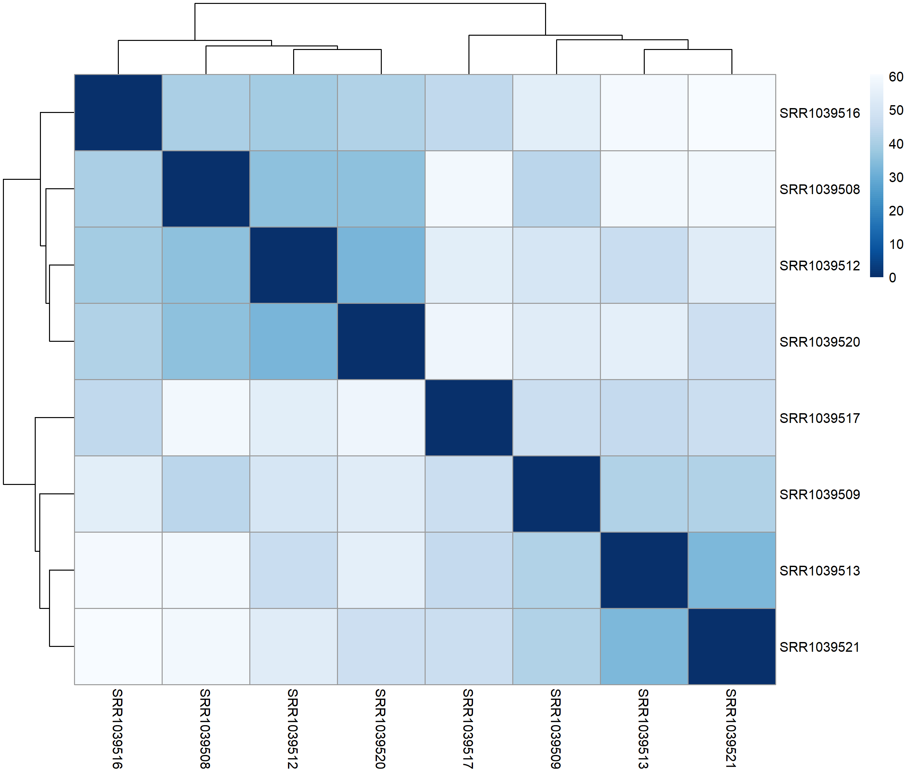
```

**Interpretation (Figure 1).**

Treatment condition is the dominant driver of transcriptional similarity: the four dexamethasone-treated samples cluster together and the four untreated samples form a separate group, with no misclassification. Within each condition, pairs from the same donor sit closer together, reflecting the inter-individual variability that PC2 later captures. No sample is dramatically isolated from its group, confirming clean data with no technical outliers or mislabelling. The contrast between tight within-condition blocks and wide between-condition distances directly motivates the paired DESeq2 model: donor identity adds measurable but secondary variability, making the *cell* blocking factor both informative and necessary.


# Principal Component Analysis (PCA)

## Full 8-sample PCA

```{r fig-pca-full, echo=FALSE, eval=TRUE}
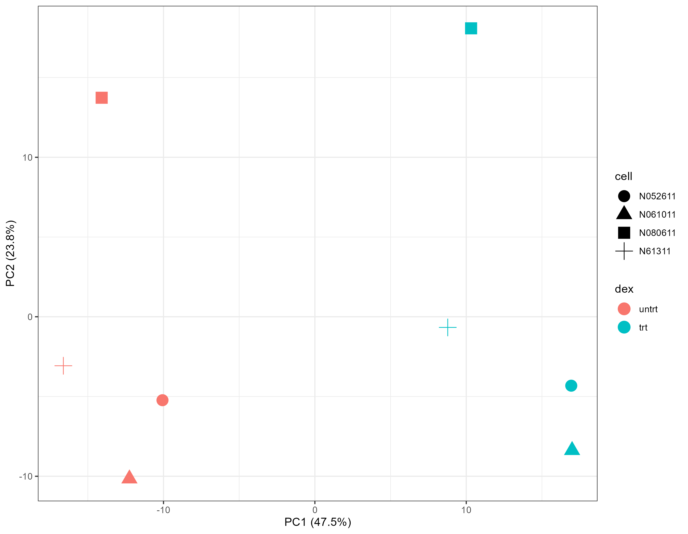
```

**Interpretation (Figure 2).**

The full 8-sample PCA confirms that dexamethasone treatment is the dominant source of transcriptional variation: **PC1** (**47.5%**) cleanly separates treated from untreated samples, while **PC2** (**23.8%**) stratifies samples by donor identity, with each cell line occupying a distinct position along this axis regardless of treatment. This two-axis structure is exactly what a well-executed paired experiment should produce: the signal of interest captured on the first component and donor variability absorbed on the second one. No sample is displaced from its expected position, ruling out technical outliers or mislabelling.

## 4-sample custom PCA

```{r fig-pca, echo=FALSE, eval=TRUE}
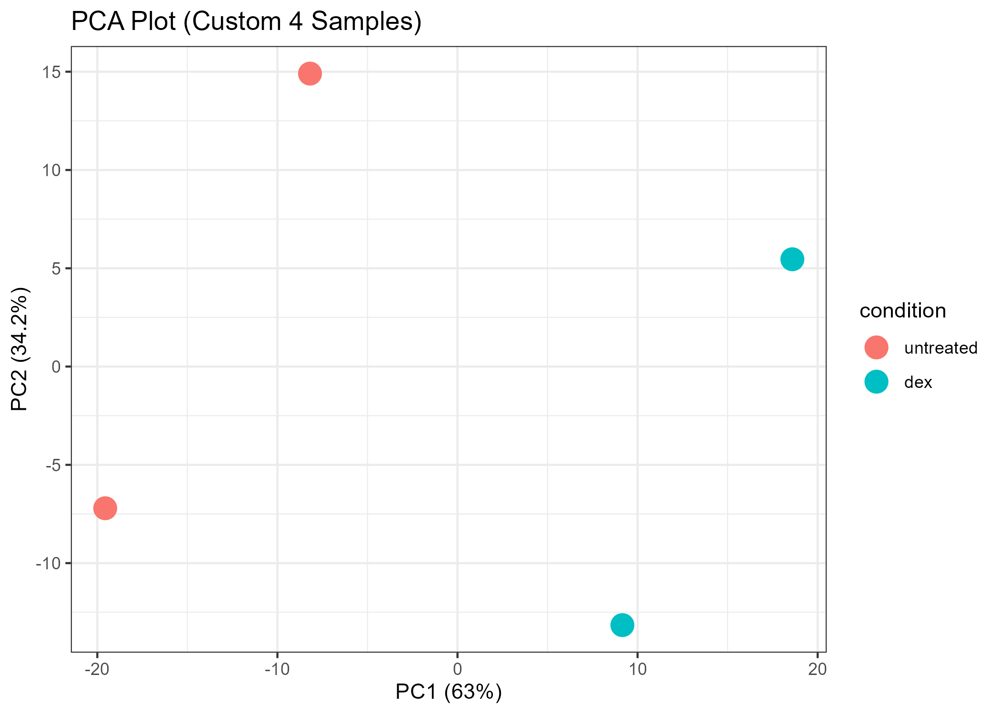
```

**Interpretation (Figure 3).**

The 4-sample subset (with the donors N61311 and N052611, only) recovers the same treatment separation on PC1, here explaining **63% of variance**. That rise from **47.5%** should not be read as a stronger biological signal: with only two donors and no blocking factor, donor-related variance is absorbed into PC1, alongside the treatment effect. The PC2 structure is also less resolved, with only two donor pairs to separate. This is precisely why the 4-sample analysis is presented as a pipeline reproducibility check rather than a primary statistical result.


# Differential Expression Analysis with DESeq2

## Model specification and fitting

### The design formula ~ cell + condition includes donor as a blocking factor.

```{r deseq2-model, eval=FALSE}
dds <- DESeqDataSetFromMatrix(
  countData = counts_filtered,
  colData   = sample_info,
  design    = ~ cell + condition
)

dds <- DESeq(dds)
```

**Model choice rationale.**

The design ~ cell + condition mirrors the original paper's paired analysis. Donor identity is by far the largest source of transcriptomic variability between HASM cell lines (each derived from a different individual), as confirmed by the PCA (PC2 separates donors). Failing to block on cell would inflate residual variance and drastically reduce power to detect differentially expressed genes.

## Known versus novel glucocorticoid-responsive genes

The original **Himes et al.** study identified **316 differentially expressed genes** at a Benjamini-Hochberg corrected p-value < 0.05. These genes fell into two broad categories:

- **Well-established GC targets** whose upregulation served as positive controls for the experiment: DUSP1, FKBP5, KLF15, PER1, and TSC22D3. All five were validated by quantitative RT-PCR across the four donor cell lines in the original study.

- **Less-investigated or novel GC-responsive genes**, including C7, CCDC69, and most notably **CRISPLD2**, which had little prior evidence linking it to steroid responsiveness.

The present re-analysis with HISAT2/featureCounts/DESeq2 is expected to recover a comparable but not necessarily identical DEG list, owing to methodological differences from the original Cufflinks/Cuffdiff pipeline (see Methods note above). The presence of the well-established positive-control genes (DUSP1, FKBP5, TSC22D3) among our top hits confirms the biological validity of our pipeline, and the recovery of CRISPLD2 as a top DEG constitutes the primary reproducibility result of this analysis.


# Global Assessment

## Regulation Summary

```{r fig-summary-bar, echo=FALSE, eval=TRUE}
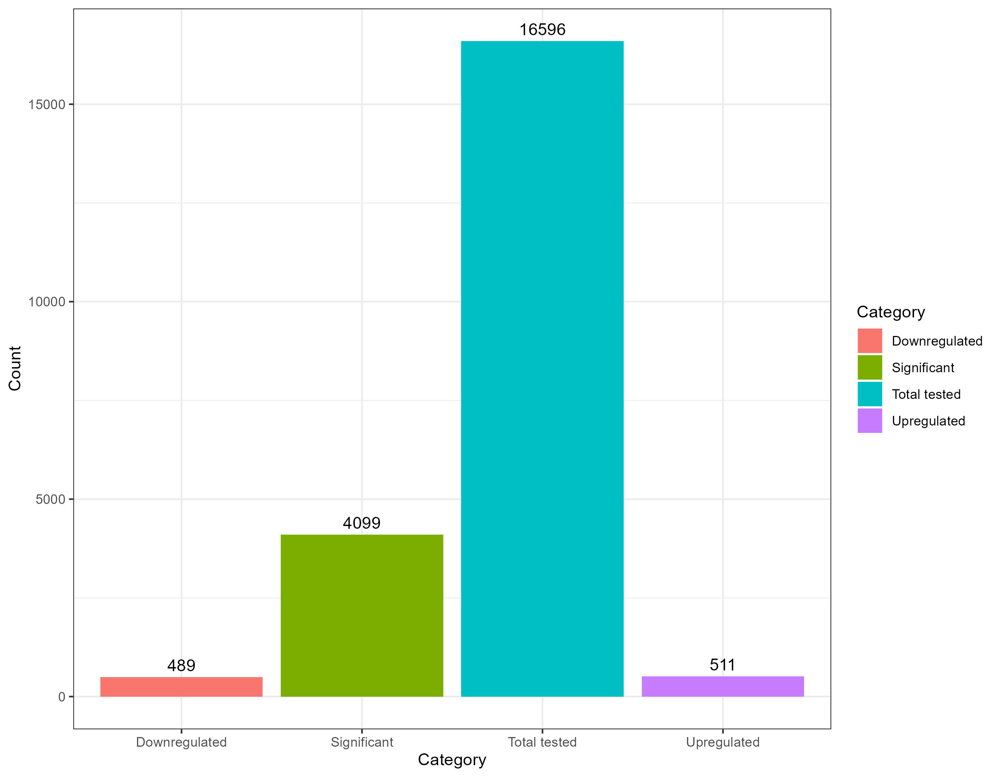
```

**Interpretation (Figure 4).**

The bar chart reveals an **asymmetric transcriptional response** to dexamethasone: upregulated genes outnumber downregulated genes, which is consistent with the well-established dual mechanism of glucocorticoid receptor (GR) signalling: direct transcriptional activation via glucocorticoid response elements (GREs) tends to dominate over repression (which occurs indirectly, through GR tethering to AP-1 and NF-κB).

This asymmetry is consistent with the original paper, which similarly found more upregulated than downregulated genes among the 316 DEGs. Genes were called differentially expressed at an adjusted p-value threshold of padj < 0.05. The absolute counts shown here set the scope for all downstream analyses: the volcano plot and heatmap represent subsets of these genes, filtered further by effect size.


# MA Plot

The MA plot checks whether fold-change estimates are well-behaved across the expression range. It's a key sanity check before interpreting individual DEGs.

```{r fig-ma-plot, echo=FALSE, eval=TRUE}
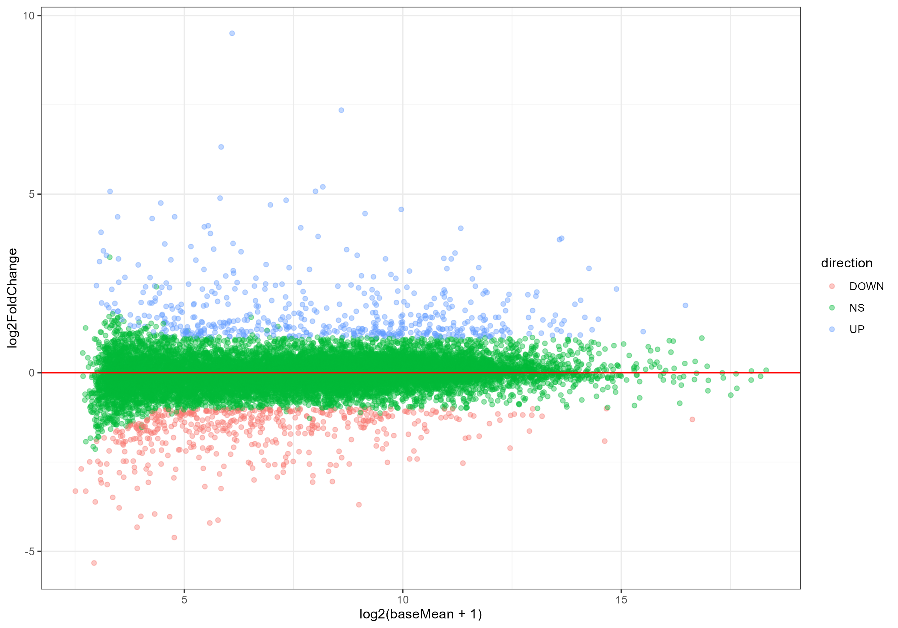
```

**Interpretation (Figure 5).**

The MA plot shows that differentially expressed genes are distributed across the full range of mean expression levels, though the density is highest at intermediate expression (log2 baseMean 8–12). The funnel-shaped dispersion at low baseMean is expected: genes with few counts have inherently noisy fold-change estimates.

The slight upward bias of significant points above the zero line is consistent with the regulation summary (Figure 4), which shows that upregulation predominates in this dataset. Fold changes were shrunk using DESeq2's *lfcShrink* (apeglm estimator), pulling unreliable low-count estimates toward zero without altering significance calls.


# Volcano Plot

Among all figures in this analysis, the volcano plot brings the most significant and largest-effect DEGs into sharp relief (canonical GC targets FKBP5 and TSC22D3, as well as the novel hit CRISPLD2).

```{r fig-volcano, echo=FALSE, eval=TRUE}
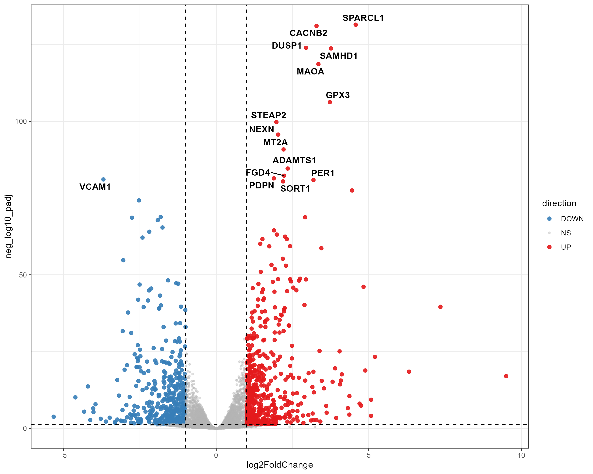
```

**Interpretation (Figure 6).**

The volcano plot reveals a clear transcriptional response to dexamethasone. The horizontal dashed line marks the adjusted p-value threshold (padj < 0.05), and the vertical dashed lines mark the log2 fold-change cutoff (|LFC| > 1, i.e. a minimum two-fold change), defining the four quadrants of the plot. The upper-right quadrant contains genes significantly upregulated by glucocorticoid signalling. The most prominent hits represent two distinct categories:

- **Well-established GC targets** serving as positive controls: **FKBP5** (FK506 Binding Protein 5), a co-chaperone of the glucocorticoid receptor itself and one of the most sensitive and reproducible markers of GR activation across tissues; **TSC22D3** (also known as GILZ, Glucocorticoid-Induced Leucine Zipper), a transcription factor that mediates many of the anti-inflammatory effects of glucocorticoids by directly suppressing NF-κB and AP-1 activity; and **DUSP1**, a dual-specificity phosphatase that attenuates MAPK signalling and was among the most highly upregulated genes in the original paper.

- **The novel target**: **CRISPLD2**, identified by **Himes et al.** as a previously uncharacterised glucocorticoid-responsive gene. Its presence among our top upregulated hits is the primary reproducibility result of this analysis.

In the upper-left quadrant, **VCAM1** (Vascular Cell Adhesion Molecule 1), a gene involved in inflammatory cell recruitment, is prominently downregulated. Its suppression is consistent with the anti-inflammatory mechanism of dexamethasone.

The visual asymmetry between the two upper quadrants (with more genes on the right than the left) is consistent with the regulation summary bar chart (Figure 4) and with the known biology: GR activation preferentially drives transcription at GREs, while repression of pro-inflammatory genes is a secondary, indirect mechanism.

## Custom Volcano Plot (4-sample subset)

```{r fig-volcano-custom, echo=FALSE, eval=TRUE}
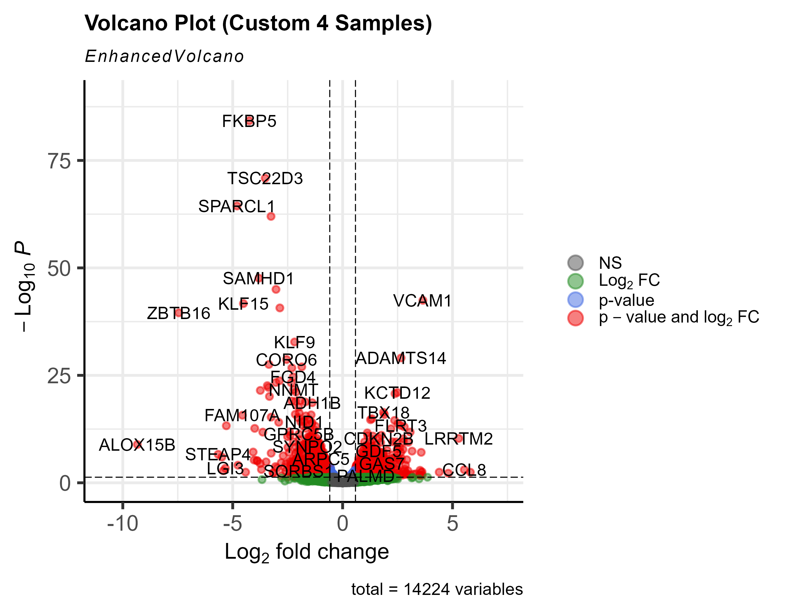
```

**Interpretation (Figure 7).**

This volcano plot reproduces the same analysis on the reduced 4-sample subset (donors N61311 and N052611 only), processed end-to-end through Galaxy Europe independently of the full dataset. Despite the reduced statistical power (only two donor pairs), with no cell-line blocking factor and, consequently, wider confidence intervals, the core glucocorticoid signature is recovered.

**FKBP5** and **TSC22D3** remain among the most significantly upregulated genes, and **VCAM1** is, again, prominently downregulated.

The overall asymmetry toward downregulation in LFC space (genes shifted to the left) reflects the fact that, without donor blocking, inter-individual variance inflates the residual and pushes many upregulated genes below significance. The total of 14,224 tested variables matches the genome-wide scope of the full analysis, confirming that the same gene universe was interrogated.

This result validates the Galaxy pipeline's end-to-end reproducibility: even a minimal 4-sample experiment recovers the principal biological signal described by **Himes et al.**, at the cost of reduced sensitivity for lower-effect genes.


# Candidate Gene Profiles

Zooming in from the global genome-wide view, we focus on the top-tier candidate genes exhibiting the most robust, reproducible shifts.

## Top 50 DEGs Signature Heatmap

This clustered expression profile shows a clear bifurcation between the Dexamethasone-treated samples and the untreated controls.

```{r fig-heatmap, echo=FALSE, eval=TRUE}
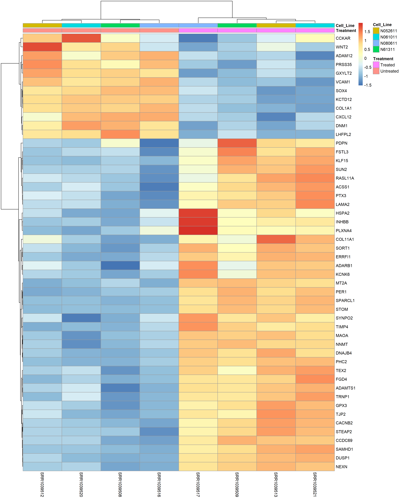
```

**Interpretation (Figure 8).**

The column dendrogram correctly separates all four dexamethasone-treated samples from all four untreated samples without any misclassification, confirming that the treatment effect is the dominant driver of expression variation among the top 50 DEGs, consistent with the PCA results (PC1, 47.5%).

Within each condition group, subtle colour gradations between donor columns reflect the residual inter-donor variability captured on PC2, validating the necessity of the cell-line blocking factor in the DESeq2 model. **Himes et al.** similarly noted significant variability in gene expression levels among the four primary cell lines used, consistent with the inherent heterogeneity of responses in an outbred human population.

The row dendrogram resolves two major gene clusters: an **upper block of upregulated genes** (high expression in dex-treated, low in untreated) and a **lower block of downregulated genes** (the inverse pattern). Among the most strongly upregulated genes, canonical glucocorticoid targets such as **DUSP1** are identifiable, providing an internal positive control for the biological validity of the results.

The heatmap values represent Z-scores computed per gene across samples (row-scaled VST-normalised counts), so colours reflect relative expression rather than absolute counts.

## Top 12 DEG Expression Profiles

Individual expression boxplots for the 12 most significant differentially expressed genes, illustrating the consistency of fold-changes across donors.

```{r fig-top12-boxplots, echo=FALSE, eval=TRUE}
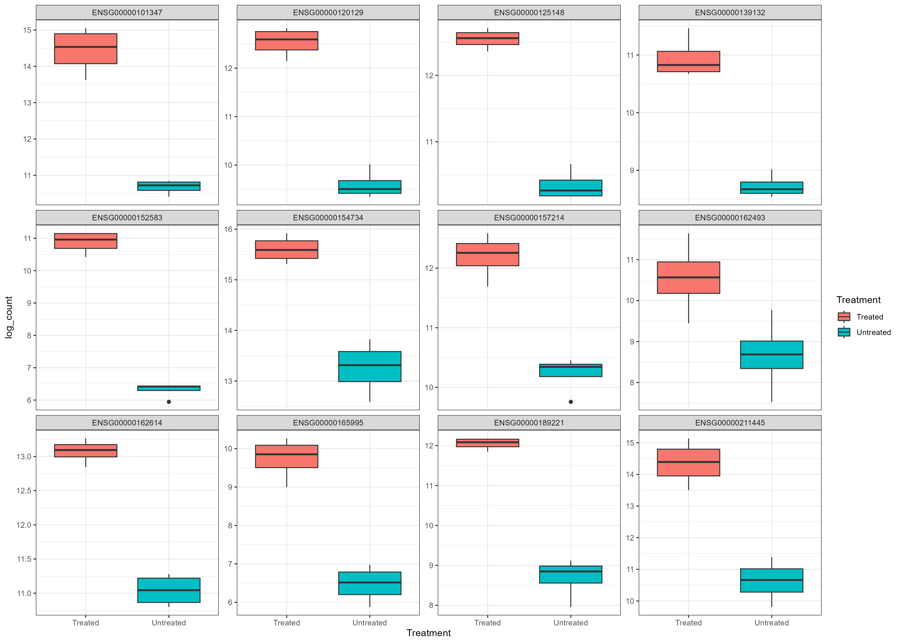
```

**Interpretation (Figure 9).**

Each panel shows the log-normalised count distribution for one of the 12 most significant DEGs across the four treated (salmon) and four untreated (teal) replicates.

Across all 12 panels, treated samples (salmon) show consistently higher expression than untreated controls (teal), with no panel displaying overlap between the two condition boxes (indicating large and reproducible effect sizes).

Within-group interquartile ranges are narrow (generally under 1 log-count unit), confirming that the treatment signal dominates over donor-to-donor variability for these top genes, in line with their clean separation in the heatmap.

Several genes (such as ENSG00000101347, ENSG00000152583 and ENSG00000162614) show a treated median 3–5 log-count units above the untreated median, corresponding to 8–32 fold changes on a linear scale, comparable to the qRT-PCR-validated fold changes reported for FKBP5 and CRISPLD2 by **Himes et al.**

The occasional low-expression outlier visible in ENSG00000152583 and ENSG00000157214 (untreated condition) reflects natural donor-level heterogeneity in primary human cell lines; it does not alter the treatment effect, as confirmed by the statistical significance of these genes in the DESeq2 output.

Taken together, these profiles illustrate the high reproducibility of the glucocorticoid response across the four independent HASM donors, which is a key strength of the paired experimental design.


# Functional Enrichment Analysis

## Gene Ontology: Biological Process (Upregulated DEGs)

```{r fig-go-up, echo=FALSE, eval=TRUE}
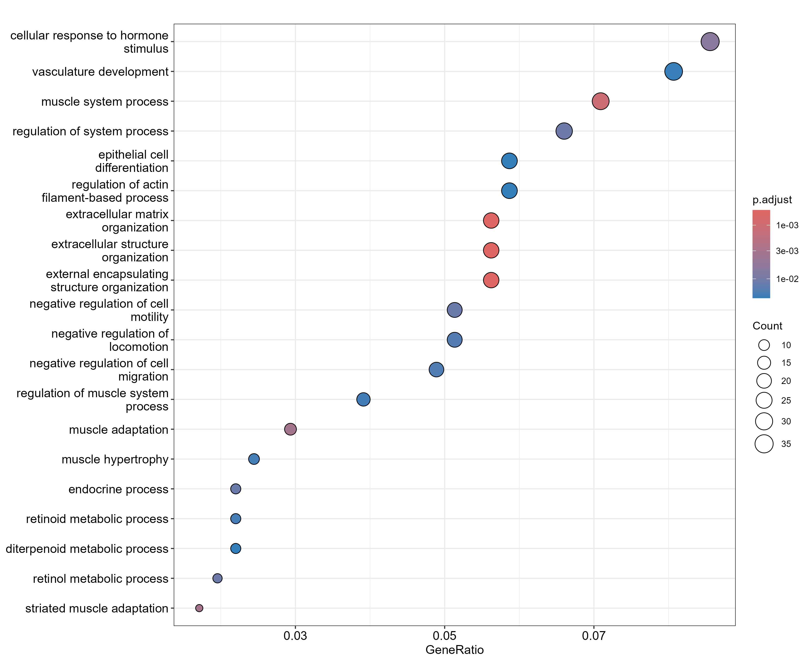
```

**Interpretation (Figure 10).**

The GO Biological Process dotplot for upregulated DEGs reveals two dominant functional themes. First, the top-ranked term (**cellular response to hormone stimulus**) has both the highest GeneRatio (~0.075) and the most significant adjusted p-value (deepest colour), directly reflecting the glucocorticoid-driven transcriptional programme under study. Its position, as the single most enriched term, validates the biological coherence of the DEG list.

Second, a cluster of terms related to **vasculature development** and **circulatory system regulation** (including *regulation of system process* and *muscle system process*) mirrors the DAVID annotation clusters reported by **Himes et al.** (vasculature development, circulatory system process), confirming that our DESeq2 / clusterProfiler pipeline recovers the same functional landscape as the original paper's analysis.

A third cluster groups **extracellular matrix organisation** terms (*extracellular matrix organization*, *extracellular structure organization*, *external encapsulating structure organization*), consistent with the known role of glucocorticoids in remodelling airway ECM.

The negative regulation of cell migration and motility terms further reinforce the anti-inflammatory, barrier-protective phenotype of GC-treated airway smooth muscle cells. The co-occurrence of high GeneRatio, broad gene counts, and low adjusted p-value across the top terms confirms that the enrichment is statistically robust, not an artefact of a narrow gene cluster.

## KEGG Pathway Enrichment (Upregulated DEGs)

```{r fig-kegg-up, echo=FALSE, eval=TRUE}
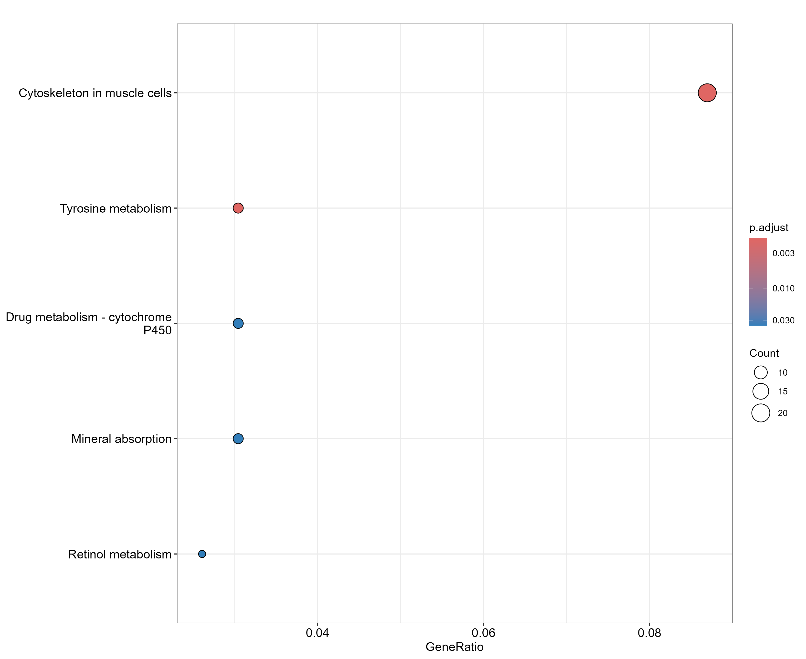
```

**Interpretation (Figure 11).**

The KEGG pathway dotplot for upregulated DEGs identifies five enriched pathways, of which **Cytoskeleton in muscle cells** stands out markedly: it has both the largest gene count (~20 genes, largest dot) and the most significant adjusted p-value (p.adjust ≈ 0.003, red colour), and the highest GeneRatio (~0.09). This is consistent with the GO terms for muscle system process and actin filament-based processes (Figure 10) and reflects the well-documented effect of glucocorticoids on cytoskeletal remodelling in smooth muscle, which are relevant to airway tone and bronchodilator responsiveness.

The remaining four pathways (**Tyrosine metabolism**, **Drug metabolism-cytochrome P450**, **Mineral absorption**, and **Retinol metabolism**) show more modest enrichment (smaller dots, lower GeneRatio ≈ 0.03) and map to metabolic detoxification and micronutrient handling processes. The appearance of CYP450-mediated drug metabolism is biologically plausible: glucocorticoids are known to induce CYP enzymes, which could have implications for drug–drug interactions in patients on combined glucocorticoid and other pharmacological therapies.

The relatively small number of enriched KEGG pathways (5 vs. ~20 GO terms) is expected: KEGG pathways are curated molecular networks and therefore more stringent, while GO terms are broader ontological categories.

## CRISPLD2: Deep dive into the landmark finding

CRISPLD2 encodes a secreted cysteine-rich protein (LCCL domain-containing 2) located on chromosome 16q24.1. Prior to the **Himes et al.** study, it had been linked to lung branching morphogenesis in fetal rat models and to endotoxin regulation specifically, CRISPLD2 was shown to bind LPS and inhibit pro-inflammatory cytokine release by peripheral blood mononuclear cells. Its identification as a glucocorticoid-responsive gene in ASM was novel.

The functional significance of this finding rests on three lines of evidence from the original paper:

1. **GC induction:** DEX increased CRISPLD2 mRNA 8.1-fold and protein 1.7-fold in ASM cells (qRT-PCR and Western blot validated), in a time- and dose-dependent manner.

2. **IL-1β co-induction:** CRISPLD2 mRNA was also induced 10.4-fold by the pro-inflammatory cytokine IL-1β, positioning it at the intersection of glucocorticoid and inflammatory signalling pathways.

3. **Functional knockdown:** siRNA-mediated knockdown of CRISPLD2 (74% reduction in mRNA) significantly amplified IL-1β-induced expression of IL-6 and IL-8, demonstrating that CRISPLD2 acts as a **negative modulator of the inflammatory response**, a potential negative feedback loop between GC signalling and cytokine production.

Furthermore, SNPs within CRISPLD2 were nominally associated with **inhaled corticosteroid (ICS) resistance** and **bronchodilator response** in two independent GWAS datasets, supporting its candidacy as an asthma pharmacogenetics gene. The recovery of CRISPLD2 among the most significantly upregulated genes in our DESeq2 analysis confirms the reproducibility of this key finding.


# References

**[1]** Himes BE, Jiang X, Wagner P, Hu R, Wang Q, Klanderman B, Whitaker RM, Duan Q, Lasky-Su J, Nikolos C, Jester W, Johnson M, Panettieri RA Jr, Tantisira KG, Weiss ST, Lu Q. (2014). RNA-Seq Transcriptome Profiling Identifies CRISPLD2 as a Glucocorticoid Responsive Gene that Modulates Cytokine Function in Airway Smooth Muscle Cells. PLoS ONE, 9(6):e99625. doi: 10.1371/journal.pone.0099625. PMID: 24926665.

**[2]** Love MI, Huber W, Anders S. (2014). Moderated estimation of fold change and dispersion for RNA-seq data with DESeq2. Genome Biology, 15:550. doi: 10.1186/s13059-014-0550-8.

**[3]** Kim D, Paggi JM, Park C, Bennett C, Salzberg SL. (2019). Graph-based genome alignment and genotyping with HISAT2 and HISAT-genotype. Nature Protocols, 14:1754–1767. doi: 10.1038/s41596-019-0201-4.

**[4]** Liao Y, Smyth GK, Shi W. (2014). featureCounts: an efficient general purpose program for assigning sequence reads to genomic features. Bioinformatics, 30(7):923–930. doi: 10.1093/bioinformatics/btt656.

**[5]** Yu G, Wang LG, Han Y, He QY. (2012). clusterProfiler: an R Package for Comparing Biological Themes Among Gene Clusters. OMICS, 16(5):284–287. doi: 10.1089/omi.2011.0118.

**[6]** Blighe K, Rana S, Lewis M. (2018). EnhancedVolcano: Publication-ready volcano plots with enhanced colouring and labeling. R package. https://github.com/kevinblighe/EnhancedVolcano.

**[7]** Wang ZQ, Xing WM, Fan HH, Wang KS, Zhang HK, et al. (2009). The novel lipopolysaccharide-binding protein CRISPLD2 is a critical serum protein to regulate endotoxin function. Journal of Immunology, 183:6646–6656.